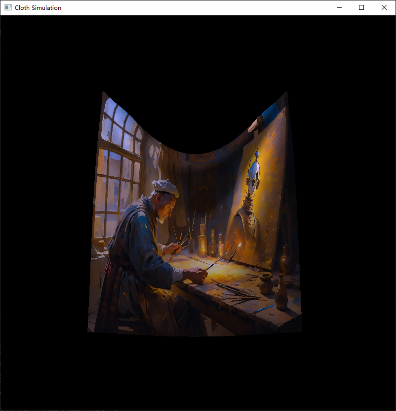
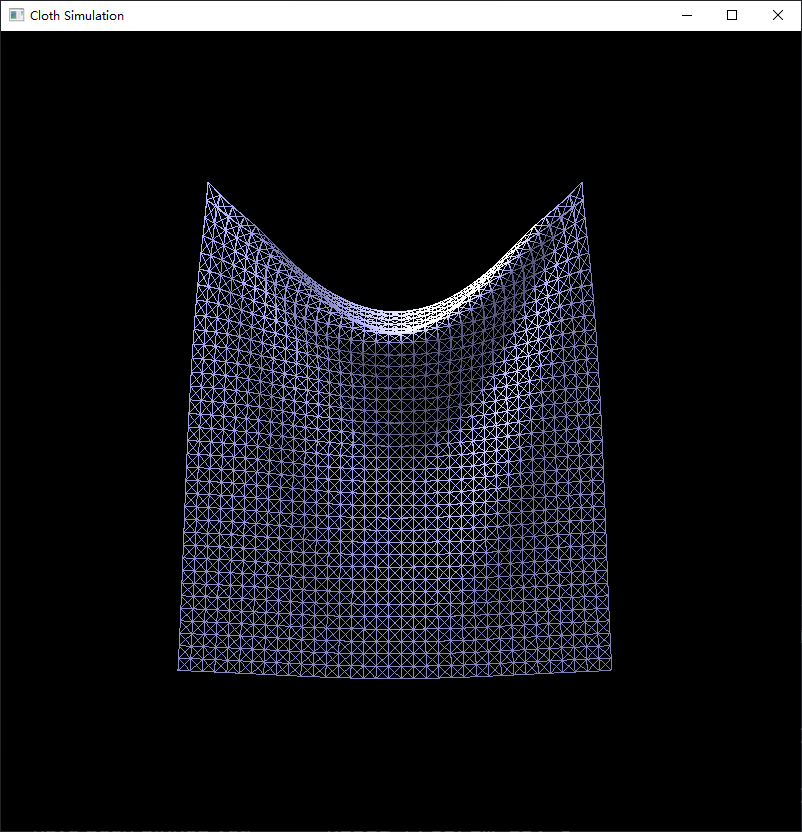

# Cloth Simulation

  

	

### UI

- ##### Window
  - `ESC` Exit
  - `R` Restart
- ##### Draw Mode: Change the rendering mode of cloth
  - `T` Switch between Cloth Mode and Texture Mode
- ##### Change the object
  - `C` Cube
  - `B` Ball
  - `D` Remove object
  
- ##### Wind Force

  - `MOUSE_BUTTON_LEFT` Click to apply wind force

### Compile and run your project with the following commands:
    cd build
    cmake ..
    make
 Use the command` ./research RK`to display the Runge-Kutta method.
 The default command `./research`will display the Euler method.

### Environment
- ##### OpenGL 3.3
  - GLAD
  - glfw
  - glew
  - glTools
- ##### Other
  - glm
### Data Structures

- ##### mass..h
  - `class Mass`

- ##### spring.h
  - `class Spring`
- ##### cloth.h
  - `class Cloth`
- ##### rigid.h -> Any rigid body without texture mapping
  - `struct Vertex`
  - `class Sphere`
  - `struct Ball`
  - `class Cube`
- ##### program.h -> Shader program built itself from .glsl files
  - `class Program`
- ##### render.h -> Global camera, light & Renderers for cloth and rigid bodies
  - `struct Camera`
  - `struct Light`
  - `struct ClothRender`
  - `struct SpringRender`
  - `struct ClothSpringRender`
  - `struct RigidRender`
  - `struct BallRender`
  - `struct CubeRender`
  